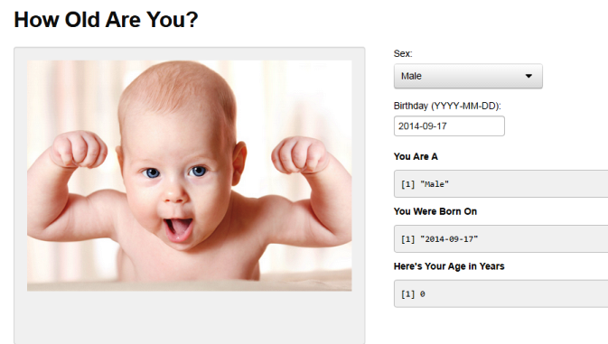

### <font color = #20B2AA> Know Your Age </font>

#### The Facts

- Studies have shown that 48% of Americans don't know how old they are 
- Inaccuracies in age calculation cost the US economy an estimated $1.2B annually
- 60% of Americans use "smart" cellular telephones or computers capable of accessing the Internet on a daily basis

#### The Future
- What if it were possible to calculate your age on your mobile phone or computer?
</br>

### <center><font color = #20B2AA>It is!</font></center>

--- .class #id 

### <font color = #20B2AA> So How Does it Work? </font>

#### Here's an exclusive look at the revolutionary technology behind the app:
```{r}
age <- function(bdate)
{round(as.numeric(difftime(Sys.Date(), as.Date(bdate), unit="weeks"))/52.25, digits = 2)}
```
</br>
#### Let's use it to calculate the age of someone who was born on July 1, 1971:
```{r, echo=FALSE, comment=NA}
bdate <- as.Date('1971-07-01')
age(bdate)
```
</br>
### <center><font color = #20B2AA>Unbelievable...And all this power is available in your pocket or on your desktop</font></center>

--- .class #id

### <font color = #20B2AA> Smooth, Intuitive User Interface Optimized for Both Desktop and Mobile </font>

<p><font color = #20B2AA> Advanced facial imaging will render your image based upon your input</font></p>




--- .class #id

### <font color = #20B2AA> Funding Requirements</font>

#### Growth and Development Goals
- Anticipated iOS and Android mobile app beta launch in Q1 2015
- Linux, Mac and Windows desktop app beta launch in Q3 2015
- Need 10 developers, 2,000 sq ft. of development space and approximately $1M capital goods to begin development

#### Financial Needs
- $1M initial seed captured
- $500K burned on development
- Additional $2M needed from venture round with additional rounds to follow
- Current valuation: $500K


